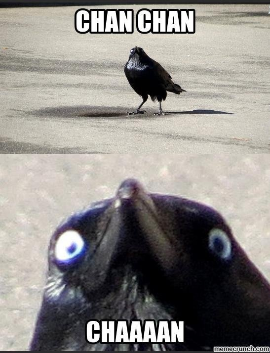

# C1-P01 — Example: First Push
**Status:** draft
**Group:** chapter-01
**Position:** Critical path, step 1 (the game's opening puzzle).

> ⚠️ **EXAMPLE — DO NOT SHIP.** Placeholder content to demonstrate teaching order.

## Assumed knowledge
- **Walk** — the player can already move around a room.

## What this puzzle teaches
- **Push**: a block moves one tile in the faced direction and cannot be pulled. This is
  the single new idea, isolated with nothing else to distract from it.

## Mechanics used
- Push
- Walk

## Setup
A 3×5 corridor. One pushable block sits directly between the player (south) and the
exit (north). No branches, no hazards, no other objects.

## Intended solution
1. Walk up to the block.
2. Push it one tile north.
3. Walk through the now-clear tile to the exit.

## Known alternate solutions
- None. The corridor is one tile wide; there is no route that avoids the push.

## Failure states
- None available. Nothing to lose, nothing to soft-lock. The block cannot be pushed
  into anything harmful because there are no hazards. Intentional for a teaching room.

## Open questions
> **OPEN:** Is a fully failure-proof opening room too gentle, or correct for teaching
> the very first mechanic? (Placeholder question.)
